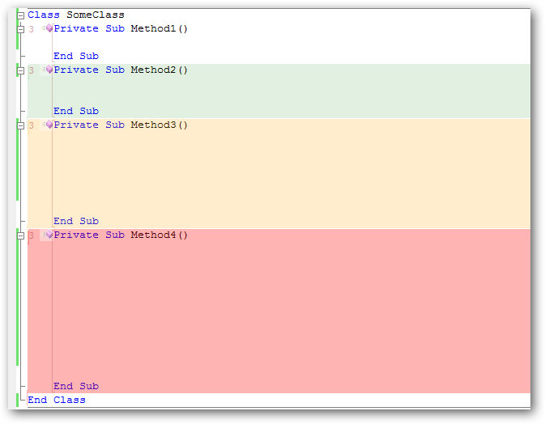
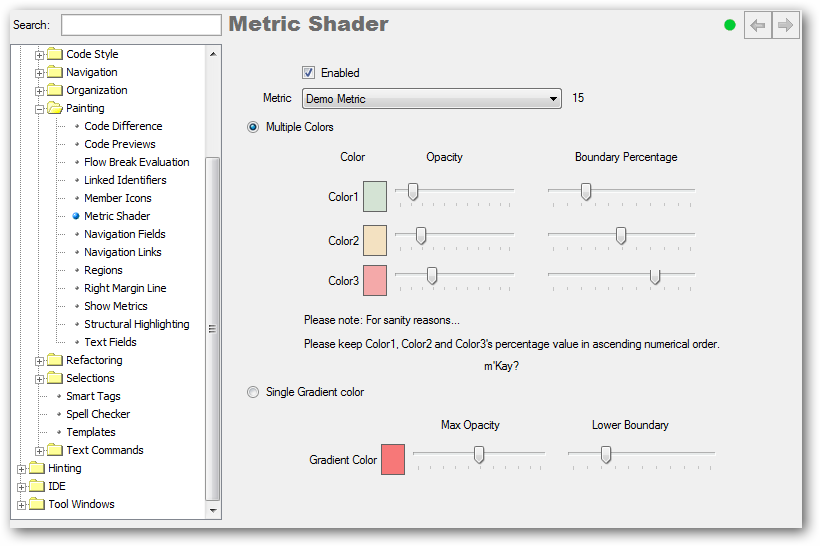
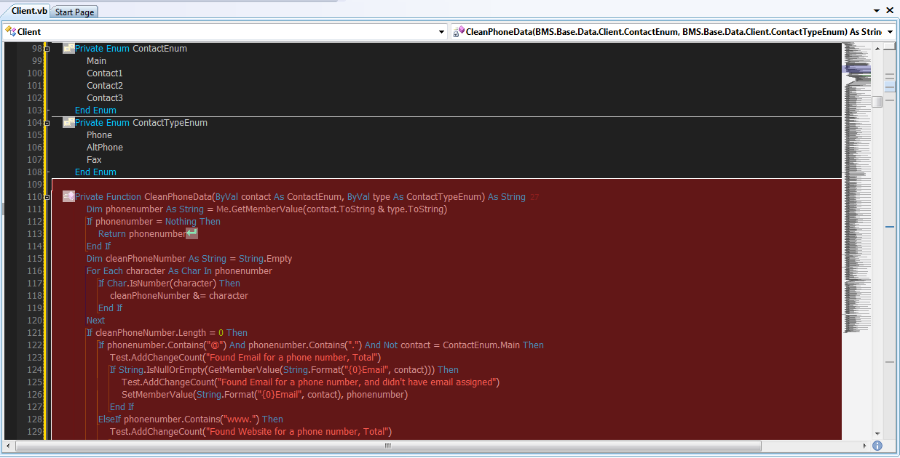

# 'Metric Shader' for CodeRush #

This plugin changes the background color of your class's members to indicate how well they adhere to a nominated metric.

Members that stack up well, remain white. The colors traffic light inspired colors show  Green, Orange, Red as the Metric value goes up.

Each metric has a numeric value which is said to be the Warning Value.

 * 0-25% = White.
 * 25-50% = Green.
 * 50-75% = Orange.
 * 75%+ = Red.

In the screenshot above I am using a Demo Metric which counts the number of lines in the member and has the Warning Value set to 15. This is a useless metric created (within this plugin) purely for the purposes of being able to create this screenshot.

### Options ###
The options screen allows you to pick from any Metric (that does its calcs on members) within CodeRush and displays it's Warning value alongside the dropdown.

Additionally you can change any of the colors, opacities of those colors or the boundaries by which the logic works.

You can also enable/disable the plugin entirely.

### Usage ###

 * Devexpress\Options (CTRL+ALT+SHIFT+O) 
 * Editor\Painting\Metric Shader
 * Pick your metric and GO.

### History ###
 * Build 1.0
	 * Moved to GitHub
 * Build 563
    * Now allows an alternate mode where a single nominated color is used with different levels of opacity to indicate poorness of metric compliance.
 * Build 556
   * Color, Opacity and Boundary Percentages now customizable.
 * Build 553
   * Adds an Enable/Disable option
 * Build 546 
   * Perf: White is no longer actively painted.
   * Perf: No member whose range falls outside the viewable screen will now be painted.

### Additional Screenshots ###

Apparently CR_MetricShader looks good on a dark scheme also :)

